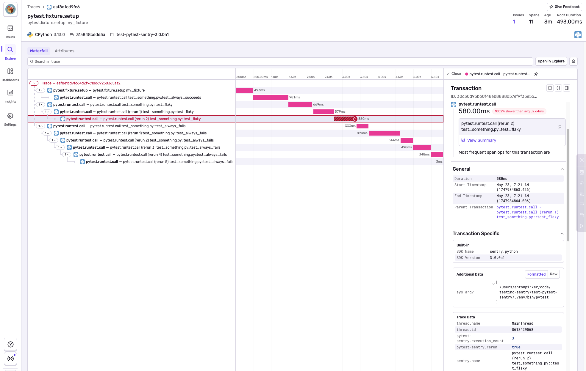

# pytest-sentry

[](https://pypi.org/project/pytest-sentry/)
[](https://pypi.org/project/pytest-sentry/)

`pytest-sentry` is a [pytest](https://pytest.org>) plugin that uses [Sentry](https://sentry.io/) to store and aggregate information about your testruns.

> [!IMPORTANT]
> **This is not an official Sentry product.**



This is what a test run will look like in Sentry.

## Quickstart
### Prerequisites

* You are using [pytest](https://pytest.org) to run your tests.
* You are using [pytest-rerunfailures](https://github.com/pytest-dev/pytest-rerunfailures) to rerun flaky tests.

### Configuration

You can configure `pytest-sentry` with environment variables:

* `PYTEST_SENTRY_DSN`: The Sentry DSN to send the data to.

* `PYTEST_SENTRY_ALWAYS_REPORT`: If not set, only flaky tests are reported as errors. If set to `1` all test failures are reported. If set to `0` no test failures are reported at all.

* `PYTEST_SENTRY_TRACES_SAMPLE_RATE`: The sample rate for tracing data. See https://docs.sentry.io/platforms/python/configuration/options/#traces_sample_rate

* `PYTEST_SENTRY_PROFILES_SAMPLE_RATE`: The sample rate for profiling data.

* `PYTEST_SENTRY_DEBUG`: Set to `1` to display Sentry debug output. See https://docs.sentry.io/platforms/python/configuration/options/#debug

### Running

If you have `pytest-rerunfailures` plugin enabled you set the environment variables and run `pytest` as usual:
```bash
export PYTEST_SENTRY_DSN="https://xx@xxx.ingest.sentry.io/xxx"  # your DSN
export PYTEST_SENTRY_TRACES_SAMPLE_RATE=1
export PYTEST_SENTRY_PROFILES_SAMPLE_RATE=1
export SENTRY_ENVIRONMENT="test-suite"

pytest --reruns=5
```

Now all flaky tests will report to the configured DSN in Sentry.io including trace information and profiles of your tests and test fixtures in an Sentry environment calld `test-suite`.

# Tracking flaky tests as errors

Let's say you have a testsuite with some flaky tests that randomly break your
CI build due to network issues, race conditions or other stuff that you don't
want to fix immediately. The known workaround is to retry those tests
automatically, for example using [pytest-rerunfailures](https://github.com/pytest-dev/pytest-rerunfailures).

One concern against plugins like this is that they just hide the bugs in your
testsuite or even other code. After all your CI build is green and your code
probably works most of the time.

`pytest-sentry` tries to make that choice a bit easier by tracking flaky test
failures in a place separate from your build status. Sentry is already a
good choice for keeping tabs on all kinds of errors, important or not, in
production, so let's try to use it in testsuites too.

The prerequisite is that you already make use of `pytest` and
`pytest-rerunfailures` in CI. Now install `pytest-sentry` and set the
`PYTEST_SENTRY_DSN` environment variable to the DSN of a new Sentry project.

Now every test failure that is "fixed" by retrying the test is reported to
Sentry, but still does not break CI. Tests that consistently fail will not be
reported.

# Tracking the performance of your testsuite

By default `pytest-sentry` will send [Performance](https://sentry.io/for/performance/) data to Sentry:

* Fixture setup is reported as "transaction" to Sentry, such that you can
  answer questions like "what is my slowest test fixture" and "what is my most
  used test fixture".

* Calls to the test function itself are reported as separate transaction such
  that you can find large, slow tests as well.

* Fixture setup related to a particular test item will be in the same trace,
  i.e. will have same trace ID. There is no common parent transaction though.
  It is purposefully dropped to spare quota as it does not contain interesting
  information::

      pytest.runtest.protocol  [one time, not sent]
        pytest.fixture.setup [multiple times, sent]
        pytest.runtest.call [one time, sent]

  The trace is per-test-item. For correlating transactions across an entire
  test run, use the automatically attached CI tags or attach some tag on your
  own.

To measure performance data, install `pytest-sentry` and set
`PYTEST_SENTRY_DSN`, like with errors. By default, the extension will send all
performance data to Sentry. If you want to limit the amount of data sent, you
can set the `PYTEST_SENTRY_TRACES_SAMPLE_RATE` environment variable to a float
between `0` and `1`. This will cause only a random sample of transactions to
be sent to Sentry.

Transactions can have noticeable runtime overhead over just reporting errors.
To disable, use a marker::

    import pytest
    import pytest_sentry

    pytestmarker = pytest.mark.sentry_client({"traces_sample_rate": 0.0})

# Advanced Options

`pytest-sentry` supports marking your tests to use a different DSN, client or
scope per-test. You can use this to provide custom options to the `Client`
object from the [Sentry SDK for Python](https://github.com/getsentry/sentry-python):

```python
import random
import pytest

from sentry_sdk import Scope
from pytest_sentry import Client

@pytest.mark.sentry_client(None)
def test_no_sentry():
    # Even though flaky, this test never gets reported to sentry
    assert random.random() > 0.5

@pytest.mark.sentry_client("MY NEW DSN")
def test_custom_dsn():
    # Use a different DSN to report errors for this one
    assert random.random() > 0.5

# Other invocations:

@pytest.mark.sentry_client(Client("CUSTOM DSN"))
@pytest.mark.sentry_client(lambda: Client("CUSTOM DSN"))
@pytest.mark.sentry_client(Scope(Client("CUSTOM DSN")))
@pytest.mark.sentry_client({"dsn": ..., "debug": True})
```

The `Client` class exposed by `pytest-sentry` only has different default
integrations. It disables some of the error-capturing integrations to avoid
sending random expected errors into your project.

# Accessing the used Sentry client

You will notice that the global functions such as
`sentry_sdk.capture_message` will not actually send events into the same DSN
you configured this plugin with. That's because `pytest-sentry` goes to
extreme lenghts to keep its own SDK setup separate from the SDK setup of the
tested code.

`pytest-sentry` exposes the `sentry_test_scope` fixture whose return value is
the `Scope` being used to send events to Sentry. Use `with use_scope(entry_test_scope):`
to temporarily switch context. You can use this to set custom tags like so::

```python
  def test_foo(sentry_test_scope):
      with use_scope(sentry_test_scope):
          sentry_sdk.set_tag("pull_request", os.environ['EXAMPLE_CI_PULL_REQUEST'])
```

Why all the hassle with the context manager? Just imagine if your tested
application would start to log some (expected) errors on its own. You would
immediately exceed your quota!

# Always reporting test failures

You can always report all test failures to Sentry by setting the environment
variable `PYTEST_SENTRY_ALWAYS_REPORT=1`.

This can be enabled for builds on the `main` or release branch, to catch
certain kinds of tests that are flaky across builds, but consistently fail or
pass within one testrun.

# License

Licensed under 2-clause BSD, see [LICENSE](LICENSE).
